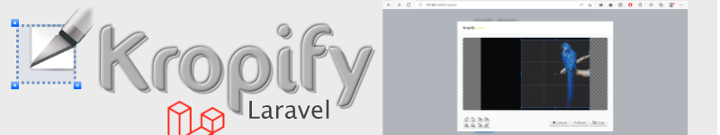

<p align="center">  
 
 

 </p>


<p align="center">

  [](https://packagist.org/packages/sawastacks/kropify-laravel) [](LICENSE) 


</p>

 # Kropify

**Sawa Stacks** brought you easy cropping image tool for user profile picture, cover image, etc... that can be integrated into Laravel project.

> **NOTE:** **`Kropify`** cannot be integrated into Laravel framework only. It has another php version that can be integrated into CodeIgniter and Core PHP projects.  

 <p align="centerx">  
 <a href="https://www.buymeacoffee.com/sawastacks" target="_blank">
   
 </a>
</p>

## What is a **Kropify**?

A **Kropify** is a tool that can be integrated into `Laravel framework`, `CodeIgniter framework` and `Core PHP` projects for the purpose of giving users easy way to crop their profile pictures and covers. It uses [JQuery 3.x](https://releases.jquery.com/) library in it's functionality as dependency. That's why it is important to include JQuery library on current blade file. 

## Requirements

- PHP >= 7.2
- [Composer](https://getcomposer.org/) is required
- Laravel 8.x, 9.x , 10.x and 11.x
- [JQuery 3.x](https://releases.jquery.com/)
- ⚠️This Version is only compatible with [Image Intervenion v2](https://image.intervention.io/v2)

# Installation

This package can be installed through `composer require`. Before install this, make sure that your are working with PHP >= 7.2 in your system.
Just run the following command in your cmd or terminal:

1. Install the package via Composer:

    ```bash
     composer require sawastacks/kropify-laravel
    ```

    The package will automatically register its service provider if your Laravel framework is 8.x or above. And also, If Image Intervention package was not installed before, This package will install Image Intervention package to your Laravel project.
2. Optionally, After you have installed **Kropify**, open your Laravel config file **`config/app.php`** and add the following lines.

    In the **`$providers`** array, add the service providers for this package.
   ```php
     SawaStacks\Utils\KropifyServiceProvider::class,
   ```
 

3. After **Kropify** package installed, you need to publish its css and js minified files in Laravel public folder by running the following command in terminal:

    ```bash
     php artisan vendor:publish --tag=kropify-assets
    ```


### Updating Package

When new **Kropify** version released and try to update the current package to the latest version, you will need to use `composer update` command:

```bash
 composer update sawastacks/kropify-laravel
```
When package not updated by using the above command, use below command that will remove current package version and install new version of package.
```bash
composer remove sawastacks/kropify-laravel && composer require sawastacks/kropify-laravel
```
After Kropify package updated, you need also to update its assets (**css** and **js** minified files) by running the following command in terminal:

```bash
 php artisan vendor:publish --tag=kropify-assets --force
```

For `Kropify` directives, you have to run this command to get immediately changes in views.

```bash
 php artisan view:clear
```

Finally, It is neccessary to run the following command to autoload package files.

```bash
composer dump-autoload
```
#
# Usage
This package uses **css** and **js** minified files, that is why you first need to include this package assets on your blade file. Place the following directive inside **`<head>`** tag of your blade file to including Kropify css file on page.
```html
<html>
 <head>
 <title>Page title</title>
  <meta name="csrf-token" content="{{ csrf_token() }}">
    @kropifyStyles 
   ......
   ...
 </head>
```
`NOTICE:` Don't forgot to add `CSRF` meta tags to every blade file included **Kropify** assets as shown in above example.

For **Kropify** Js file, you need to add the following directive or helper inside **`<body>`**  tag but before closing **`</body>`** tag after including JQuery as shown in below example.

```html
  ..........
   .....
   <script src="https://cdnjs.cloudflare.com/ajax/libs/jquery/3.7.1/jquery.min.js"></script>
   @kropifyScripts
 </body>
</html>
```

### Package initialization

Suppose that you have an input file on your form for user profile picture:

```html
 <!DOCTYPE html>
<html lang="en">
<head>
    <meta charset="UTF-8">
    <meta name="viewport" content="width=device-width, initial-scale=1.0">
    <meta http-equiv="X-UA-Compatible" content="ie=edge">
    <title>Kropify Package Creation</title>
    <meta name="csrf-token" content="{{ csrf_token() }}">
    @kropifyStyles 
    <style>
      *{ box-sizing: border-box; padding: 0; margin: 0;}
       body{ font-family: serif;  width: 100%; height: 100%; }
       .box{ display: flex;justify-content: center;align-items: center;flex-direction: column; margin-top: 20px; }
        .previewElement{ display: block;width: 120px;height: 120px;background: #ddd; }
        .previewElement img{ width: 100%; height:auto; }
    </style>
</head>
<body>
 <div class="box">
    <h4>Kropify for Laravel</h4>
    <div class="previewElement">
       
    </div>
      <div class="file-box">
        <label>User profile</label>
        <input type="file" id="avatar" name="avatar">
      </div>
  </div>
      
  ........
  ..........
  ...........
   <script src="/jquery-3.0.0.min.js"></script>
   @kropifyScripts
 
</body>
</html>
```
## Routes
```php
Route::post('/crop',[TestController::class,'cropHandler'])->name('crop-handler');
```
When you want to initiate **Kropify** on that particular input file, you will use the following scripts.
```javascript
  <script>
    $('input#avatar').kropify({
        preview:'img.preview',
        viewMode:1,
        aspectRatio:1,
        cancelButtonText:'Cancel',
        resetButtonText:'Reset',
        cropButtonText:'Crop & update',
        processURL:'{{ route("crop-handler") }}',
        maxSize:2097152, //2MB
        showLoader:true,
        animationClass:'headShake', //headShake, bounceIn, pulse
        fileName:'avatar',
        success:function(data){
         // console.log(data);
         // console.log(data.status); //Kropify status
         // console.log(data.message); //Kropify message
         // console.log(data.image.getName); //Get cropped image name
         // console.log(data.image.getSize); //Get cropped image size
         // console.log(data.image.getWidth); //Get cropped image width
         // console.log(data.image.getHeight); //Get cropped image height
          },
          errors:function(error, text){
             console.log(text);
          },
        });
    </script>
```
### Options
| Option | Default | Description 
|-------------  | :-------------: | ---------- |
| `viewMode` | 1 | You can set this value to (1,2 or 3). But you can not add this option if you are happy with the default value which is 1. |
| `aspectRatio` | 1 | You can add your custom cropped image ratio. You can use fractional numbers and float numbers. **eg**: `16/4`, `10/32`, `0.25`, `2.25`, etc... |
|`preview` | **required** | This option is very required. This is where you define the output element to preview the cropped image. Here, you must use jquery selector to select **id="..."** or **class="..."** of the img tag element where you want to display cropped image result.|
|`cancelButtonText` | Cancel | You can change this button text with your need and according to your language. |
| `resetButtonText` | Reset| You can change this button text with your need and according to your language.|
|`cropButtonText`| Crop | You can change this button text with your need and according to your language. |
|`maxSize`| 2097152 | By default, this value set to the maximum size of **2MB** .But, you can set your own maximum size of selected  image. |
|`processURL`|-|This option is very required. You must define your url of croping selected image. eg: **_processURL : "{{ route('crop') }}"_** or **_processURL : "{{ url('crop') }}"_**|
|`showLoader`|true|If you want to display loading element when user croping the selected image, you can set this option to _**true**_. But if you do not want that loading element appears on page, set this option to _**false**_.|
|`animationClass`|pulse|If you want to animate cropping area, you may use this option by choosing one of three animation classes allowed `pulse`,`headShake`,`fadeIn` and `pulse`. By default, this value set to `pulse` class.|
|`fileName`|-| This will be used when want to specify or overwrite file name of the input file. |

### Errors callback
This callback has two arguments, `error` and `text`

```javascript
 errors:function(error, text){
    console.log(text);
 }
```

| Parameter | Description 
|------------- | ---------- |
| `error` | This prameter will return two types of errors **invalidFileType** and  **bigFileSize**. You can make a `if` condition according to the returned error type. | 
| `text` | You can alert this value `eg`: alert(message);. If you are using Toastr.js plugin, You may use `toastr.error(text)'` function to display error alert.|

## In controller
To include **Kropify** class in controller is very simple. Just import the following lines on your controller.

```php
 use SawaStacks\Utils\Kropify;
```


To upload the cropped image you will use the following lines inside method:

```php
 // Image can be uploaded to public or storage path
 $path = 'uploads/'; //option 1
 $path = storage_path('app/public/uploads/'); //option 2
 $path = public_path('uploads/'); //option 3

//if you did not define name attribute on input file tag, the default name attribute value is "image". eg: $file = $request->file('image');
 $file = $request->file('avatar'); 

//Upload cropped image options
 $upload = Kropify::getFile($file)->save($path); //This will give us random image name "5678cKs374hxdu5438vhsk83.png"
 $upload = Kropify::getFile($file,'avatar')->save($path); //This will geive us image name "avatar.png"
 $upload = Kropify::getFile($file,'avatar.jpg')->save($path); //This will geive us image name "avatar.jpg"
 $upload = Kropify::getFile($file,'avatar.dng')->save($path); //When you make a mistake on extension. This will give us image name "avatar.dng.png"
 $upload = Kropify::getFile($file,'avatar.png')->maxWoH(712)->save($path); //This will resize cropped image width or height to `712`

 //Return json
 return response()->json(['status'=>"OK",'message'=>'Your profile picture has been.'], 201);
```
The above lines will upload the cropped image in the specified path. The cropped image can be uploaded in Laravel **public** folder or in Laravel **storage** folder.
Very important function on the chain is **`maxWoH()`**. This function will limit maximum dimensions (Width or Height) in px value of the uploaded image. If you do not need to compress and resize the cropped image, just do not add **``maxWoH()``** to the **Kropify** upload function chain. Make sure that `extension=gd` extension is enable in your server.

### Get Cropped/Uploaded image details
When cropped image uploaded successfully, you can get the uploaded image information like name, size, width and Height. You can use these details when you need to store them into database.
Below are examples of getting uploaded image details:

```php
$path = 'uploads/';
$file = $request->file('avatar');
$upload = Kropify::getFile($file,'avatar.png')->maxWoH(710)->save($path);

//Get All details
$infos = Kropify::getInfo(); //option 1 
$infos = $upload->getInfo(); //option 2 

//According to the above options, you can get individual image info as follow:
$image_name = $infos->getName; // IMG_XH56.jpg
$image_size = $infos->getSize; // 13094
$image_width = $infos->getWidth; // 710
$image_height = $infos->getHeigth; // 710

//You can also get individual image name, size, width and height after image uploaded without first getting all info as follow:

$image_name = $upload->getName(); //option 1
$image_name = Kropify::getName(); //option 2

$image_size = $upload->getSize(); //option 1
$image_size = Kropify::getSize(); //option 2

$image_width = $upload->getWidth(); //option 1
$image_width = Kropify::getWidth(); //option 2

$image_height = $upload->getHeigth(); //option 1
$image_height = Kropify::getHeigth(); //option 2


/**
 * According to the above guidance, use the following examples 
 * to save cropped image data into database.
 */

 $user = new User();
 $user->profile = $image_name; //IMG_USER_982.jpg
 $user->save();

 //Return json data
 return response()->json([
   'status'=>"OK",
   'message'=>'Your profile picture has been successfully updated.',
   'imageInfo'=>$infos], 
   201);
```

## Not supported
`1.` Currently, uploading cropped image using Laravel **`Livewire`** is not supported. This package still in development, Once uploading cropped image in Laravel Livewire available, we will notify you.
You can not also upload image to AWS Amazon `S3`.

`2.` This package is still in development, that is why you can not make two or more instances on single page of this jquery scripts part.

<br>

## Copyright and License

This package was written by [Sawa Stacks](https://github.com/sawastacks) and is released under the [MIT License](https://github.com/sawastacks/kropify-laravel/blob/master/LICENSE).

Copyright (c) 2023 - Sawa Stacks
